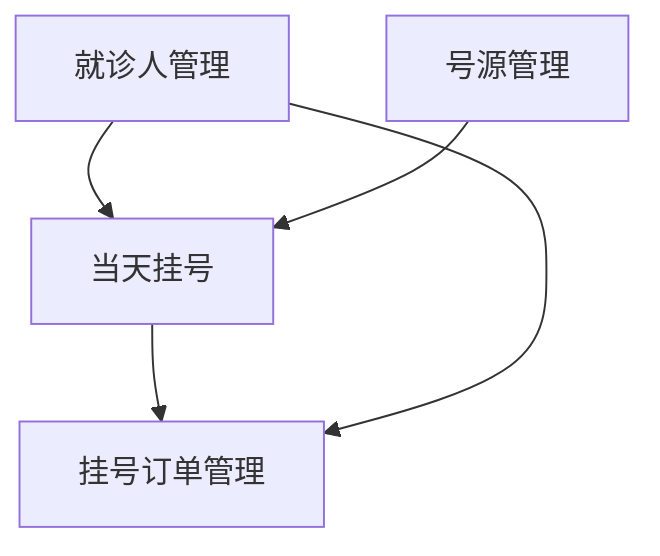

# 02-modules

## 模块拆分清单

| 优先级 | 模块名称 | 职责 | 依赖模块 | 关联功能点 | 状态 | 负责人 |
|--------|----------|------|----------|------------|------|--------|
| P1 | 就诊人管理 | 就诊人档案的增删改查、信息加密存储 | 无 | F001-01 移动端就诊人管理、F001-03 管理端就诊人管理 | ✅ 已实现 | ai |
| P1 | 号源管理 | 当天号源配置（科室/医生/时间段/总号数）、余量扣减与回滚 | 无 | F001-02 当天挂号 | ✅ 已实现 | ai |
| P2 | 当天挂号 | 移动端浏览号源、选择就诊人、提交挂号、生成挂号凭证 | 就诊人管理、号源管理 | F001-02 当天挂号 | ✅ 已实现 | ai |
| P3 | 挂号订单管理 | 挂号订单查询、退号/改号、状态流转；管理端列表与筛选 | 当天挂号、就诊人管理 | F001-04 挂号订单管理 | ✅ 已实现 | ai |

## 模块依赖图

## 模块状态追踪表

| 模块名称 | 模块设计 | 接口契约 | 前端设计 | 数据库设计 | 实现归属 | 状态 |
|----------|----------|----------|----------|------------|----------|------|
| 就诊人管理 | `docs/02-modules/patient/README.md` | `docs/06-api/patient.md` | `docs/04-frontend/features/patient.md` | `docs/05-database/schemas/patient.md` | ai | ✅ 已实现 |
| 号源管理 | `docs/02-modules/schedule/README.md` | `docs/06-api/schedule.md` | `docs/04-frontend/features/schedule.md` | `docs/05-database/schemas/schedule.md` | ai | ✅ 已实现 |
| 当天挂号 | `docs/02-modules/registration/README.md` | `docs/06-api/registration.md` | `docs/04-frontend/features/registration.md` | `docs/05-database/schemas/registration.md` | ai | ✅ 已实现 |
| 挂号订单管理 | `docs/02-modules/order/README.md` | `docs/06-api/order.md` | `docs/04-frontend/features/order.md` | `docs/05-database/schemas/order.md` | ai | ✅ 已实现 |

## 模块文档索引

| 模块名称 | 模块设计路径 | 接口契约路径 | 前端设计路径 | 数据库设计路径 | 状态 |
|----------|-------------|-------------|-------------|---------------|------|
| 就诊人管理 | `docs/02-modules/patient/README.md` | `docs/06-api/patient.md` | `docs/04-frontend/features/patient.md` | `docs/05-database/schemas/patient.md` | ✅ 已实现 |
| 号源管理 | `docs/02-modules/schedule/README.md` | `docs/06-api/schedule.md` | `docs/04-frontend/features/schedule.md` | `docs/05-database/schemas/schedule.md` | ✅ 已实现 |
| 当天挂号 | `docs/02-modules/registration/README.md` | `docs/06-api/registration.md` | `docs/04-frontend/features/registration.md` | `docs/05-database/schemas/registration.md` | ✅ 已确认 |
| 挂号订单管理 | `docs/02-modules/order/README.md` | `docs/06-api/order.md` | `docs/04-frontend/features/order.md` | `docs/05-database/schemas/order.md` | ✅ 已实现 |
