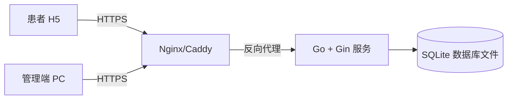

# 03-architecture

## 技术选型及理由
| 技术 | 选型 | 理由 |
|------|------|------|
| 前端框架 | React 18 + Vite | 用户指定；组件化开发，H5 与管理端可复用基础组件；Vite 构建速度快 |
| 后端框架 | Go + Gin | 用户指定；高性能、编译型语言，适合中小型服务；Gin 生态成熟、路由简洁 |
| 数据库 | SQLite | 用户指定；单机文件型数据库，零运维成本，适合诊所/社区医院轻量部署 |
| 缓存 | 无（前期） | 系统规模小，SQLite + 内存缓存足够；后续可升级 Redis |
| 消息队列 | 无 | 当天挂号业务实时性强，暂不需要异步队列 |
| 部署平台 | 单机服务器 / Docker | 轻量部署，支持反向代理（Nginx/Caddy）暴露服务 |

## 系统部署图

**部署说明**：单服务器运行 Go 后端服务，SQLite 以文件形式存储于服务器本地。Nginx/Caddy 做反向代理和静态资源托管（React 构建产物）。

## 核心数据流

### 数据流 1：患者当天挂号
1. 患者打开 H5 页面 → 浏览当天号源（科室/医生/时间段）
2. 选择号源 → 系统校验余号
3. 选择/添加就诊人 → 提交挂号
4. 后端创建挂号订单 → 扣减号源余量 → 返回挂号凭证
5. 患者可在 H5 查看挂号记录

### 数据流 2：管理端订单管理
1. 管理员登录 PC 管理端 → 查看当天挂号订单列表
2. 可按状态（待就诊/已就诊/已退号）筛选
3. 支持退号/改号操作 → 同步回写号源余量
4. 可查看就诊人档案详情

## 前端运行环境

- **前端框架**：React 18 + Vite
- **开发端口**：5173
- **代理方案（开发）**：Vite dev proxy
- **跨域处理（生产）**：后端开启 CORS
- **部署方式**：静态资源托管（Nginx）
- **说明**：H5 与管理端共用 React 组件库，通过响应式或独立入口区分；生产环境由 Nginx 托管构建产物，API 请求通过 Nginx 反向代理到 Go 后端

## 后端运行环境

- **后端语言及框架**：Go + Gin
- **服务端口**：8080
- **部署环境**：生产环境
- **容器化**：Docker
- **说明**：Go 服务以 Docker 容器运行，暴露 8080 端口；Nginx 将前端静态资源和 API 请求统一反向代理到该端口

## 数据存储

- **数据库类型**：SQLite
- **部署方式**：本地文件，随 Go 应用容器一起部署
- **数据库文件路径**：`./data/clinic.db`
- **账号**：SQLite 无需账号密码，通过文件权限控制访问
- **中间件**：暂不涉及
- **说明**：SQLite 文件挂载到 Docker 容器的持久化卷中，重启不丢失；后续若规模扩大可平滑迁移至 PostgreSQL/MySQL
- **并发策略**：启用 WAL（Write-Ahead Logging）模式提升读并发；写操作通过单一连接池串行化，避免写锁竞争；乐观锁模式用于号源扣减（`UPDATE ... WHERE remaining > 0`）
- **并发上限预期**：单机约支持 50-100 TPS 写操作，满足中小型诊所日常挂号需求；读操作（号源浏览、订单查询）可支撑更高并发

## 安全设计
- **管理端鉴权**：JWT（Bearer Token），有效期 24 小时，登录页 `/login` 获取
- **H5 端鉴权**：访客手机号模式。首次访问 H5 页面时跳转至登录页 `/h5/login`，用户输入手机号后系统发送短信验证码（当前阶段可 mock 为固定验证码 `123456`），验证通过后访客手机号存入 localStorage/sessionStorage，后续 API 请求通过 `X-Visitor-Phone` Header 传递。退出或清除缓存后需重新验证。
- **敏感数据加密**：就诊人身份证、手机号 AES 加密存储，密钥通过环境变量注入
- **接口限流**：基于 IP 的挂号接口限流（10 次/分钟），防止恶意刷号
