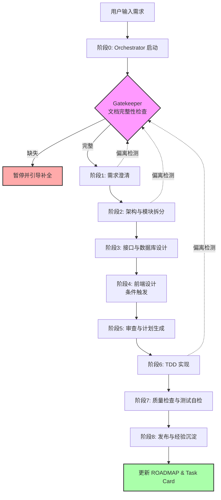

# 数据流：Orchestrator 自循环主流程

## 说明

1. **阶段0**：Orchestrator 读取 `AGENTS.md` + `docs/00-index.md`，确认文档链完整
2. **阶段1-5**：设计阶段，产出并更新 GSD 文档树
3. **阶段6**：实现阶段，按依赖图并行派发 subagent，Red-Green 配对执行
4. **阶段7**：并行运行 `health` 和 `qa`，门禁不通过则自动修复（有上限）
5. **阶段8**：调用 `ship` + `learn`，闭环结束
6. **偏离检测**：任何阶段若发现实现与文档约束不符，回退到 Gatekeeper 进行校正
