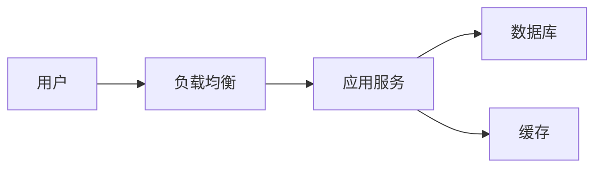

# deployment

## 部署架构

```mermaid
graph LR
    User[用户] --> LB[负载均衡]
    LB --> App[应用服务]
    App --> DB[数据库]
    App --> Cache[缓存]
```

## 环境列表
| 环境 | 地址 | 备注 |
|------|------|------|
| 开发 | | |
| 测试 | | |
| 生产 | | |
