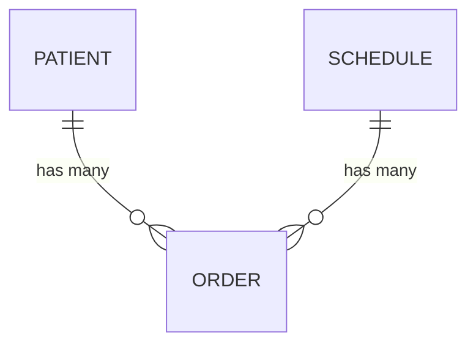

# 05-database

## ER 图

## 表结构规范
| 表名 | 用途 | 核心字段 | 数据库设计文档 |
|------|------|----------|---------------|
| patients | 就诊人档案 | name, id_card, phone, visitor_phone | docs/05-database/schemas/patient.md |
| schedules | 当天号源 | department, doctor_name, date, start_time, end_time, total_count, remaining | docs/05-database/schemas/schedule.md |
| orders | 挂号订单 | order_no, schedule_id, patient_id, status, visitor_phone | docs/05-database/schemas/registration.md |

## 模块数据库设计映射

| 模块名称 | 表/领域名 | 数据库设计文档路径 |
|----------|----------|-------------------|
| 就诊人管理 | patients | docs/05-database/schemas/patient.md |
| 号源管理 | schedules | docs/05-database/schemas/schedule.md |
| 当天挂号 | orders | docs/05-database/schemas/registration.md |
| 挂号订单管理 | orders（扩展字段） | docs/05-database/schemas/order.md |

## 命名规范
- 表名：小写复数
- 字段名：小写 + 下划线
- 索引名：pk_表名 / uk_表名_字段名 / idx_表名_字段名

## 迁移策略
- 工具：手写 SQL 文件按序号管理
- 回滚策略：每个迁移文件提供 DOWN 语句
